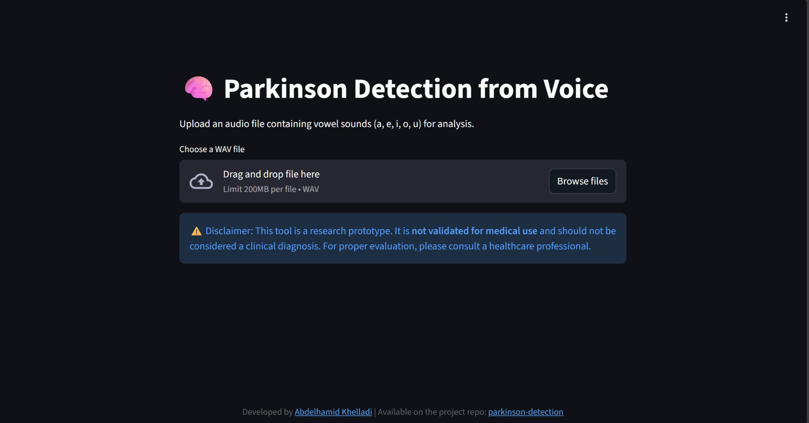
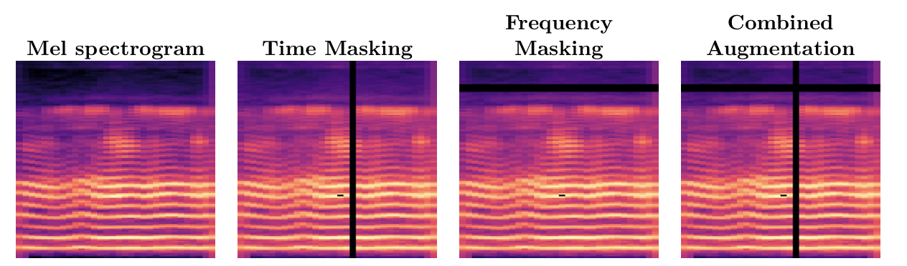

# parkinson-detection

## 📖 Description
This project is an implementation of my final year project **"Early Detection of Parkinson's Disease using Deep Learning Approaches"**.  
We used patients' audio recordings from the [Italian Parkinson’s Voice and Speech dataset](https://ieee-dataport.org/open-access/italian-parkinsons-voice-and-speech) with different preprocessing techniques and several models.  

In this repository, I included one representative model for each data type:
- **VGG16 + CBAM** → for 2D spectrogram data  
- **SVM** → for tabular acoustic features  
- **ReSE-2-Multi** → for raw audio  

It was built mainly using **PyTorch**.  
The ultimate goal of this project is to create a **web application for Parkinson's disease detection**.  

⚠️ **Disclaimer**:  
This project is for **research and educational purposes only**.  
It is **not validated for medical diagnosis** and must not be used as a substitute for professional healthcare advice.  

---
## 🚀 Installation

Clone the repository and install the required dependencies:

```bash
git clone https://github.com/AbdelhamidKHELLADI/parkinson-detection
cd parkinson-detection
make install
```
## How to use

If you want to run training experiments:  
1. Download the [Italian Parkinson’s Voice and Speech dataset](https://ieee-dataport.org/open-access/italian-parkinsons-voice-and-speech).  
2. Extract the files into the appropriate data directory.  
3. Create a `.env` file to store environment variables.  
   - Alternatively, you can directly edit the variable values in the code if working locally.  

👉 If you prefer to skip training and use the pretrained SVM model, check the section below:  
### 🖥️ Run the Web App (Streamlit)

You can try the interactive web app built with Streamlit:
```bash
# Run the Streamlit web app
streamlit run app.py
```

Then open your browser at http://localhost:8501
.
You can upload an audio file (preferably a sustained vowel: a, e, i, o, u) and get a prediction result (Healthy / Parkinson).



---

### 🔬 Data Preparation & Training

The following steps are only needed if you want to preprocess the dataset and train models yourself (instead of using the pretrained SVM with the Streamlit app).


### Segment records 
```bash
make segment
```
Segments the raw audio recordings into smaller clips.
### extract Features (Acoustic features & MFCC)
```bash
make preprocess
```
Extracts acoustic features and MFCCs from the segmented audio.
### create Mel spectrograms

```bash
make create_2d
```
Generates 2D Mel-spectrogram images from audio.



### Train SVM model

```bash
make train_svm
```
Trains the SVM model on the extracted tabular features.

### Predict using SVM model

```bash
make predict_svm  AUDIO="path/to/wav_file"
```


## 🛠 Project Structure

```bash
parkinson-detection/
├── app.py                # Streamlit web app
├── requirements.txt      # Python dependencies
├── Makefile              # Automation commands
├── etc/                  # Config files or additional resources
├── models/               # Saved and trained models
├── predict/              # Prediction scripts 
├── preprocessing/        # Data preprocessing scripts
├── results/              # Experiment results, logs, and outputs
├── train/                # Training scripts for different models
└── utils/                # Utility/helper functions

```
## 📄 License
This project is licensed under the [MIT License](./LICENSE).
